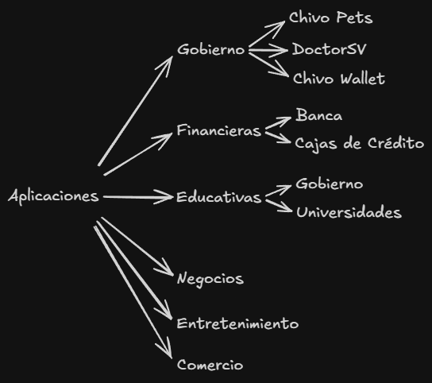

# Teórica 1 (DAM2) - 20/1/2026
Introducción a la asignatura.

## Mercado de aplicaciones móviles en El Salvador (2026)

## Tarea
### Por grupos
* Video explicativo de la instalación de MacOs.
* Puesta en marcha de Xcode.
* Desarrollo de los siguientes programas usando swift:
  * Operaciones aritméticas
  * Tipos de variables.